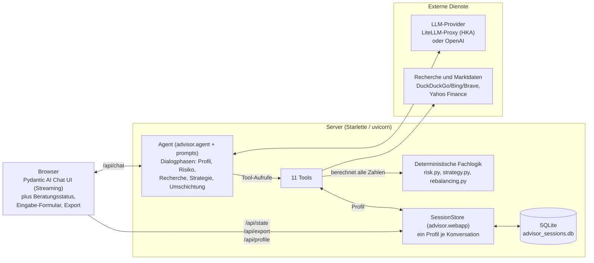

# Persönlicher Finanzberater-Chatbot

Ein deutschsprachiger Chatbot, der Nutzer per Dialog profiliert (Ziele, Kapital,
Risikobereitschaft, Rahmendaten), aktuell per Web-Recherche passende, breit
gestreute Anlageprodukte identifiziert und daraus eine konkrete, nachvollziehbare
und personalisierte Anlagestrategie ableitet – inklusive Asset-Allokation in
Prozent, Produktvorschlägen, Sparplan-Aufteilung und Begründung je Baustein.

> **Wichtiger Hinweis:** Dieses Projekt ist ein Hochschulprojekt und **keine
> zugelassene Anlage-, Steuer- oder Rechtsberatung**. Alle Ausgaben des Bots
> sind allgemeine Informationen zur eigenen Entscheidungsfindung, ohne
> Garantien oder Renditeversprechen. Kapitalanlagen können zu Verlusten führen.

**Inhalt:** [Features](#features) · [Architektur](#architektur) ·
[Fachlogik im Detail](#fachlogik-im-detail) · [Setup](#setup) ·
[Konfiguration](#konfiguration-umgebungsvariablen) ·
[API-Endpunkte](#api-endpunkte) · [Tests](#tests-und-qualitätssicherung) ·
[HKA-LLM-Server](#nutzung-mit-dem-hka-llm-server-empfohlen) ·
[Mehrere Nutzer](#mehrere-nutzer--zugriff-im-netzwerk) ·
[Troubleshooting](#troubleshooting-bei-modellfehlern) ·
[Fachliche Grundlagen](#fachliche-grundlagen-aus-den-vorlesungsunterlagen) ·
[Entscheidungen](#entscheidungen) · [Roadmap](#verbesserungsvorschläge--roadmap) ·
[Einschränkungen](#nicht-umgesetzt--einschränkungen)

## Features

- **Nutzer-Profiling per Dialog** – der Bot fragt Schritt für Schritt (nicht
  alles auf einmal): Anlageziel und Zeithorizont, vorhandene Anlagen und Depot,
  monatliche Sparrate und Einmalbetrag, Schulden und Notgroschen, Alter,
  Land/Steuerkontext und Anlageerfahrung.
- **Szenariobasierte Risikoprofilierung** – statt „hoch/mittel/niedrig“ fragt
  der Bot u. a. die Reaktion auf einen hypothetischen 20-%-Kursverlust und die
  maximal tragbare zwischenzeitliche Verlusthöhe ab. Risikobereitschaft
  (subjektiv) und Risikotragfähigkeit (objektiv) werden getrennt bewertet;
  die schwächere Dimension begrenzt (Vorsichtsprinzip).
- **Session-State pro Konversation, SQLite-persistiert** – jedes Gespräch
  (Chat in der UI) hat sein eigenes serverseitiges Profil: bereits beantwortete
  Fragen werden nicht erneut gestellt, ein neuer Chat startet mit leerem
  Profil, und mehrere Personen können den Server gleichzeitig nutzen, ohne
  sich die Profile zu teilen. Die Profile werden in `advisor_sessions.db`
  gespiegelt und überleben Server-Neustarts.
- **Beratungsstatus, Eingabe-Formular und Export in der UI** – ein Panel zeigt
  jederzeit die aktuelle Phase (Profil → Risiko → Strategie → abgeschlossen),
  die erfassten Angaben, eine Risiko-Skala und den Verlauf der Risikoklasse im
  Gespräch. Eckdaten lassen sich alternativ über ein Formular (inkl.
  Risiko-Regler) statt im Dialog erfassen, und die fertige Beratung ist als
  Markdown bzw. PDF (Druckansicht) exportierbar – inklusive Disclaimer.
  Während der Profilierung zeigt der Bot eine Fortschrittsanzeige (x/13
  Angaben), die deterministisch berechnet wird.
- **Aktuelle Web-Recherche mit Marktlage-Check und Emittenten-Prüfung** –
  Websuche und Nachrichten-Suche (DuckDuckGo/Bing/Brave, ohne API-Key,
  mit Datum und Quelle), Seiten-Abruf und Marktdaten von Yahoo Finance.
  Vor jeder Strategie verschafft sich der Bot ein aktuelles Bild der
  Marktlage (Zinsen, Inflation, geopolitische Risiken – ohne Market-Timing)
  und prüft jedes empfohlene Produkt: Fondsvolumen, Replikation, bei
  Anleihen die Emittenten (Staaten/Unternehmen, Bonität, aktuelle
  Warnsignale), bei Einzeltiteln das konkrete Unternehmen bzw. den Staat
  inklusive aktueller Nachrichtenlage.
- **Quantitative Strategie-Engine** – Aktienquote als Bernoulli-/Markowitz-
  Nutzenoptimum `U = E(x) − a·Var(x)` mit horizont- und liquiditätsabhängigen
  Kappungen; daraus Asset-Allokation in Prozent, Sparplan-Aufteilung der
  Monatsrate (mit Mindestraten) und Aufteilung des Einmalbetrags.
- **Umschichtungsplan mit Gebühren und Steuerschätzung** – für Nutzer mit
  Bestandsdepot berechnet der Bot konkrete Kauf- und Verkaufsempfehlungen vom
  Ist-Depot zur Ziel-Allokation: „neues Geld zuerst" (minimiert Verkäufe,
  Gebühren und Steuerrealisierung), Verkäufe nur oberhalb einer
  Abweichungsschwelle, Ordergebühren (Prozent + Mindestgebühr) je Trade.
  Mit bekannten Einstandswerten schätzt er je Verkauf den realisierten
  Gewinn/Verlust und die Steuer (Abgeltungsteuer + Soli, 30 % Teilfreistellung
  bei Aktienfonds), erklärt Sparer-Pauschbetrag und Verlustverrechnung
  (Verrechnungstöpfe, Verlustvortrag) und zeigt Verlustpositionen als
  Verrechnungs-Chance auf. Fremdpositionen („sonstiges") werden nie
  automatisch zum Verkauf gesetzt.
- **Verständliche Erklärungen** – Diversifikation, Risiko/Rendite, Zeithorizont
  und Rebalancing werden begründet und auf Deutsch erklärt.
- **Disclaimer eingebaut** – zu Gesprächsbeginn und am Ende jeder Strategie.

## Architektur

Basis ist das **chatbot-pydanticai-template** (Begründung siehe
[Entscheidungen](#entscheidungen)): ein Pydantic-AI-Agent, der die offizielle
Pydantic AI Chat UI ausliefert. Statt `agent.to_web()` (nur *ein* geteiltes
Deps-Objekt für alle Requests) nutzt das Projekt eine eigene Web-Schicht
[`webapp.py`](src/advisor/webapp.py) auf demselben `VercelAIAdapter` – damit
bekommt jede Konversation ihr eigenes, in SQLite persistiertes Profil.



Die **11 Tools** im Detail: vier zum Profil (`speichere_profil`,
`speichere_profil_mehrere`, `zeige_profil`, `profil_zuruecksetzen`), drei für
die Berechnungen (`ermittle_risikoprofil_tool`, `erstelle_strategie_tool`,
`erstelle_umschichtungsplan_tool`) und vier für die Recherche (`web_suche`,
`nachrichten_suche`, `lese_webseite`, `marktdaten`).

**UI-Fluss / Beratungsprozess** (angelehnt an den Portfolio-Management-Prozess
aus dem Finanzmanagement-Skript, Kap. 1&2):

1. **Begrüßung + Disclaimer** (optional vorab: Eckdaten über das
   Eingabe-Formular der UI erfassen) → 2. **Profilierung** (eine Frage pro
   Nachricht; jede Antwort wird sofort via `speichere_profil` bzw.
   `speichere_profil_mehrere` in den Session-State geschrieben; der aktuelle
   Profilstand wird dem Agenten in jede Anfrage injiziert, sodass nichts
   doppelt gefragt wird; Fortschrittsanzeige x/13) → 3. **Risikoprofil**
   (Berechnung + verständliche Erklärung, Bestätigung durch Nutzer) →
   4. **Recherche** (Marktlage-Check, aktuelle ETFs/Produkte, Kosten,
   Marktdaten, Emittenten-Prüfung) → 5. **Strategie** (Allokation, Produkte,
   Sparplan, Begründungen, Hinweise, Disclaimer) → 6. **Umschichtung**
   (bei Bestandsdepot: Kauf-/Verkaufsplan mit Gebühren und Steuerschätzung) →
   7. **Rückfragen/Anpassungen** (Profilupdates → Neuberechnung).
   Der jeweilige Stand ist jederzeit im **Beratungsstatus-Panel** sichtbar und
   als Markdown/PDF exportierbar.

### Modulübersicht

| Modul | Aufgabe |
|---|---|
| `src/advisor/config.py` | Modell-/Provider-Konfiguration aus `.env` (Pattern aus dem Template: OpenAI direkt oder LiteLLM-Proxy) |
| `src/advisor/prompts.py` | Deutscher System-Prompt: Rolle, Phasenmodell, Regeln (Disclaimer, keine Garantien, keine erfundenen ISINs) |
| `src/advisor/profile.py` | `UserProfile` (Pydantic) + `AdvisorDeps` (Session-State) |
| `src/advisor/risk.py` | Risikoprofilierung: Scores, Risikoklasse 1–5, Risikoaversionsparameter `a`, nutzenoptimale Aktienquote mit Kappungen |
| `src/advisor/strategy.py` | Strategische + taktische Asset-Allokation, Sparplan- und Einmalbetrags-Aufteilung, Hinweise (Notgroschen, Tilgung, Rebalancing) |
| `src/advisor/rebalancing.py` | Umschichtungsplan: Ist-Depot → Ziel-Allokation mit Ordergebühren, Handels-Schwellen und „neues Geld zuerst"-Prinzip |
| `src/advisor/research.py` | Websuche + Nachrichten-Suche (ddgs, mit Backend-Fallback), Seitenabruf (httpx + BeautifulSoup), Marktdaten (yfinance) |
| `src/advisor/agent.py` | Agent-Verdrahtung: Modell, Instructions, Tool-Registrierung (dünne Adapter um die Fachmodule) |
| `src/advisor/webapp.py` | Web-App-Schicht mit Profil **pro Konversation** (SessionStore, Chat-ID → eigenes `AdvisorDeps`, SQLite-persistiert); bildet die `to_web()`-Endpunkte über den `VercelAIAdapter` nach |
| `src/advisor/app.py` | Einstiegspunkt: verdrahtet Agent, Modell-Liste (LiteLLM) und `webapp.create_app()` |

**Designprinzip:** Das Zahlenwerk (Risikoklasse, Allokation, Sparplan) wird
**deterministisch in Python** berechnet – das LLM interpretiert, erklärt und
recherchiert, erfindet aber keine Prozentsätze. Konkrete Produktvorschläge
(Stufe „Titelauswahl“) kommen ausschließlich aus der aktuellen Web-Recherche.

## Fachlogik im Detail

Dieser Abschnitt dokumentiert die tatsächlich implementierten Regeln, damit
jede Zahl im Beratungsergebnis nachvollziehbar ist. Alle Werte stehen als
Konstanten im jeweiligen Modul und sind ohne Codeumbau änderbar.

### Das erhobene Profil

13 Pflichtangaben steuern die Dialogführung und die Fortschrittsanzeige
(`profile.py::PFLICHTANGABEN`), in dieser Reihenfolge: Anlageziel,
Zeithorizont, Alter, Land/Steuerkontext, Anlageerfahrung, vorhandene Anlagen,
Depot vorhanden, monatliche Sparrate, Einmalbetrag, Schulden, Notgroschen
(in Monatsausgaben), Reaktion auf 20 % Kursverlust, maximal tragbarer
Zwischenverlust. Hinzu kommen zwei nicht direkt erfragte Felder:
`hat_konsumschulden` (wird aus dem Schulden-Freitext abgeleitet, s. u.) und
`risikoklasse` (Ergebnis der Berechnung).

### Schritt 1: Risiko-Scores (`risk.py`)

**Risikobereitschaft** (subjektiv, 0–10 Punkte):

| Kriterium | Punkte |
|---|---|
| Reaktion auf 20 % Verlust | alles verkaufen 0 · teilweise verkaufen 1 · beunruhigt halten 2 · gelassen halten 4 · nachkaufen 5 |
| Maximal tragbarer Zwischenverlust | ≥ 40 % → 3 · ≥ 25 % → 2 · ≥ 15 % → 1 · sonst 0 |
| Anlageerfahrung | keine 0 · Grundkenntnisse 1 · fortgeschritten 2 · sehr erfahren 2 |

**Risikotragfähigkeit** (objektiv, 0–10 Punkte):

| Kriterium | Punkte |
|---|---|
| Zeithorizont | ≥ 15 J. → 4 · ≥ 10 J. → 3 · ≥ 5 J. → 2 · ≥ 3 J. → 1 |
| Notgroschen | ≥ 6 Monatsausgaben → 3 · ≥ 3 → 2 · ≥ 1 → 1 |
| Keine Konsumschulden | 2 |
| Alter unter 40 | 1 |

Beide Scores werden in Teilklassen übersetzt (0–1 → 1, 2–3 → 2, 4–6 → 3,
7–8 → 4, ab 9 → 5). Die **Risikoklasse ist das Minimum beider Teilklassen** –
die schwächere Dimension begrenzt (Vorsichtsprinzip).

### Schritt 2: Aktienquote als Nutzenoptimum (`risk.py`)

Je Risikoklasse ist ein Risikoaversionsparameter `a` der Nutzenfunktion
`U = E(x) − a·Var(x)` hinterlegt. Daraus folgt die nutzenoptimale Aktienquote
im Zwei-Anlagen-Fall (Aktien vs. Anleihen, mit Korrelation) nach der Formel aus
Kap. 3 des Skripts – kalibriert auf übliche Musterportfolios:

| Risikoklasse | Bezeichnung | `a` | Aktienquote vor Kappungen |
|---|---|---|---|
| 1 | sehr defensiv | 7,0 | ca. 17 % |
| 2 | defensiv | 4,0 | ca. 26 % |
| 3 | ausgewogen | 1,9 | ca. 51 % |
| 4 | wachstumsorientiert | 1,4 | ca. 68 % |
| 5 | offensiv | 0,9 | 100 % |

Zugrunde liegende Kapitalmarktannahmen: Aktien 7 % p. a. bei σ 16 %, Anleihen
2,5 % p. a. bei σ 5 %, Korrelation 0,2.

**Kappungen** danach (jede greift unabhängig, es zählt die niedrigste Quote):
Zeithorizont unter 3 Jahren → höchstens 10 %, unter 5 Jahren → 30 %, unter
10 Jahren → 70 %; Notgroschen unter 3 Monatsausgaben → 50 %; bestehende
Konsumschulden → 30 %. Jede angewandte Kappung wird mit Begründung
ausgegeben und vom Bot erklärt.

### Schritt 3: Asset-Allokation (`strategy.py`)

Aus der Aktienquote entsteht die Aufteilung über die Bausteine:

- **Aktien** werden 70/30 auf Industrie- und Schwellenländer verteilt
  (taktische Regionen-Diversifikation).
- **Gold** kommt mit 5 % dazu, wenn Risikoklasse ≥ 3 und Aktienquote ≥ 40 % –
  begrenzt auf den neben der Aktienquote verbleibenden Platz, damit nie
  negative Anteile entstehen.
- Der **defensive Rest** teilt sich horizontabhängig in Geldmarkt/Tagesgeld
  und Anleihen: bei unter 3 Jahren 80 % Geldmarkt, unter 5 Jahren 50 %, unter
  10 Jahren 25 %, darüber 10 %.
- Bausteine mit Anteil 0 werden nicht ausgewiesen; Rundungsdifferenzen gehen
  auf den größten Baustein.

**Sparplan:** Die Monatsrate wird nach denselben Quoten verteilt. Positionen
unter 25 € Mindestrate werden dem größten Baustein zugeschlagen, damit der Plan
bei einem realen Broker umsetzbar bleibt. Ist die Rate insgesamt sehr klein,
fließt alles in einen einzigen breiten Baustein.

**Hinweise**, die die Strategie automatisch mitgibt: Notgroschen zuerst
aufbauen (unter 3 Monatsausgaben), Konsumschulden zuerst tilgen, bei einem
Einmalbetrag ab 10.000 € die Abwägung Sofortanlage vs. gestaffelter Einstieg,
und in jedem Fall der Hinweis auf jährliches Rebalancing.

### Schritt 4: Umschichtung mit Gebühren und Steuern (`rebalancing.py`)

Für Bestandsdepots wird der Weg zur Ziel-Allokation berechnet:

- **Neues Geld zuerst:** Der Einmalbetrag füllt Untergewichte, bevor verkauft
  wird – das minimiert Gebühren und Steuerrealisierung.
- **Verkauft wird nur**, wenn ein Baustein um mindestens 5 Prozentpunkte
  übergewichtet ist *und* der Betrag mindestens 200 € erreicht; kleinere
  Abweichungen werden über künftige Sparraten ausgeglichen.
- **Gebühren:** je Order Prozentsatz plus Mindestgebühr, standardmäßig 0,25 % /
  1 € – im Dialog durch die realen Broker-Konditionen ersetzbar.
- **Steuern** (nur bei bekanntem Einstandswert): anteiliger Gewinn je Verkauf,
  darauf 26,375 % (Abgeltungsteuer plus Solidaritätszuschlag), bei Aktienfonds
  abzüglich 30 % Teilfreistellung. Realisierte Verluste werden als
  Verrechnungstopf ausgewiesen, und Verlustpositionen im Depot werden als
  Chance zur Verrechnung mit den anfallenden Gewinnen benannt – mit dem
  ausdrücklichen Hinweis, dass Steuern allein kein Verkaufsgrund sind.
- **Fremdpositionen** der Kategorie „sonstiges" (Einzelaktien, aktive Fonds,
  Krypto) werden nie automatisch zum Verkauf gesetzt, sondern zur Besprechung
  markiert.

### Robustheit gegenüber dem Sprachmodell

Damit die Beratung nicht davon abhängt, wie sorgfältig ein Modell arbeitet:

- **Ableitung statt Vertrauen:** `hat_konsumschulden` steuert eine harte
  Kappung, wird aber nicht separat abgefragt – ein Validator leitet es aus dem
  Schulden-Freitext ab („Ratenkredit", „Dispo" → ja; „keine" → nein).
  Immobilienkredite zählen bewusst nicht als Konsumschulden.
- **Tolerante Eingaben:** Freie Formulierungen werden vor der Validierung
  normalisiert („Anfänger/Grundkenntnisse" → `grundkenntnisse`, „würde
  abwarten" → `gelassen_halten`, „ja"/„nein" → Boolean), statt einen
  Validierungsfehler in die UI durchschlagen zu lassen.
- **Sammel-Tool:** Mehrere Angaben aus einer Nachricht werden in *einem*
  Tool-Aufruf gespeichert; viele parallele Einzelaufrufe führten bei
  schwächeren Modellen zu verlorenen Angaben.
- **Verweigerung statt Raten:** Risiko- und Strategie-Tools liefern nichts,
  solange Pflichtangaben fehlen, und nennen die offenen Punkte.
- **Wiederholungen und Grenzen:** bis zu drei Korrekturversuche bei
  ungültigen Tool-Argumenten, bis zu vier Anläufe (0,5 s / 1,5 s / 3 s Pause)
  bei wiederholbaren Provider-Fehlern, 120 s Timeout und 6.000 Token je
  Anfrage.
- **Sitzungsverwaltung:** bis zu 200 Konversationen im Arbeitsspeicher
  (älteste werden verdrängt und bei Bedarf aus SQLite nachgeladen);
  beschädigte Datensätze starten mit leerem Profil, statt die App zu
  blockieren.

## Setup

Voraussetzungen: Python ≥ 3.10, [uv](https://docs.astral.sh/uv/), ein API-Key
für den gewählten LLM-Provider.

```bash
git clone https://github.com/dominikwipfler/personal_financial_advisor.git
cd personal_financial_advisor

# Abhängigkeiten installieren
uv sync

# API-Key konfigurieren (Pattern aus dem Template)
cp .env.example .env
# .env editieren: OPENAI_API_KEY=sk-... (und optional ADVISOR_MODEL)

# Starten
uv run uvicorn advisor.app:app --reload
```

Danach <http://localhost:8000> öffnen – die Chat-UI lädt beim ersten Aufruf
vom CDN und wird lokal gecacht.

Beim ersten Start legt die App automatisch `advisor_sessions.db` im
Projektverzeichnis an (SQLite, Nutzerprofile pro Konversation – überlebt
Server-Neustarts). Kein manueller Schritt nötig; Pfad optional über
`ADVISOR_DB_PATH` in der `.env` änderbar.

### Konfiguration (Umgebungsvariablen)

Alle Einstellungen kommen aus der Umgebung bzw. der lokalen `.env`
(Vorlage: [.env.example](.env.example)); keine davon ist zwingend außer dem
Zugang zum Modell. Ausgewertet werden sie in
[`config.py`](src/advisor/config.py).

| Variable | Standard | Bedeutung |
|---|---|---|
| `OPENAI_API_KEY` / `ANTHROPIC_API_KEY` | – | API-Key bei direkter Provider-Nutzung |
| `ADVISOR_MODEL` | `openai:gpt-4o-mini` | Modell im Format `<provider>:<modell>` (nur ohne LiteLLM) |
| `USE_LITELLM` | aus | `1`/`true`/`yes` erzwingt den LiteLLM-Betrieb; aktiviert sich auch automatisch, wenn `LITELLM_SERVER_URL` **und** `LITELLM_API_KEY` gesetzt sind |
| `LITELLM_SERVER_URL` | `http://localhost:4000` | Basis-URL des LiteLLM-Proxys (für die HKA: `https://llm.hka-cloud.de`) |
| `LITELLM_API_KEY` | – | Virtual Key des Proxys |
| `LITELLM_MODEL` | `gpt-4o-mini` | Modell-ID **wie der Proxy sie listet** (hier: `gemini-3-flash-preview`) |
| `ADVISOR_DB_PATH` | `advisor_sessions.db` | Pfad der SQLite-Datei für die Profile, relativ zum Startverzeichnis |
| `ADVISOR_REASONING_EFFORT` | `low` | Reasoning-Aufwand (`none`…`max`). `medium` bringt gründlichere Recherche bei längerer Wartezeit; wird nur an OpenAI-/gpt-oss-Modelle gesendet |
| `ADVISOR_REQUEST_TIMEOUT_S` | `120` | Timeout je Modellanfrage in Sekunden |
| `ADVISOR_MAX_TOKENS` | `6000` | Token-Limit je Antwort; zu klein → abgeschnittene Tool-Argumente |

### API-Endpunkte

Die Web-Schicht ([`webapp.py`](src/advisor/webapp.py)) stellt neben der Chat-UI
unter `/` diese Endpunkte bereit. `{chat_id}` ist die Konversations-ID der
Chat-UI und bestimmt, welches Profil verwendet wird.

| Endpunkt | Methode | Zweck |
|---|---|---|
| `/api/chat` | POST | Chat-Stream (Vercel AI Data Stream); führt den Agenten aus und persistiert das Profil nach Abschluss des Streams |
| `/api/configure` | GET | Modell-Liste für den Selector der UI |
| `/api/health` | GET | Statusprüfung inkl. Anzahl aktiver Sitzungen |
| `/api/state/{chat_id}` | GET | Beratungsstatus: Phase, erfasste Angaben, Fortschritt, Risiko inkl. Verlauf, Strategie, Umschichtungsplan |
| `/api/profile/{chat_id}` | POST | Mehrere Profilfelder auf einmal setzen (Eingabe-Formular der UI); validiert wie das Agenten-Tool, aber ohne Umweg über das LLM |
| `/api/export/{chat_id}` | GET | Beratungszusammenfassung als Markdown-Download, mit `?format=html` als Druckansicht („Als PDF speichern") |

### Tests und Qualitätssicherung

```bash
uv run pytest                      # 65 Tests, laufen OHNE API-Key
uv run --group dev ty check src/   # statische Typprüfung
```

Die Testsuite läuft vollständig ohne LLM-Zugang: Die Fachlogik ist
deterministisch, und der Agenten-Ablauf wird mit dem `FunctionModel` von
Pydantic AI simuliert (ein Skript-Modell, das vorgegebene Tool-Aufrufe
zurückgibt). Dadurch sind auch Tool-Verkettung und Session-State testbar,
ohne API-Kosten zu verursachen.

| Testdatei | Tests | Prüft |
|---|---|---|
| `tests/test_risk_strategy.py` | 9 | Risikoprofilierung und Allokation: Monotonie der Aktienquote, Vorsichtsprinzip, Kappungen, Summenkonsistenz, keine negativen Anteile, Ableitung der Konsumschulden |
| `tests/test_rebalancing.py` | 9 | Umschichtung: „neues Geld zuerst", Handels-Schwellen, Gebühren, Steuerschätzung mit Teilfreistellung, Verlustverrechnung, Schutz von Fremdpositionen |
| `tests/test_profil_normalisierung.py` | 26 | Tolerante Verarbeitung freier Formulierungen („Anfänger/Grundkenntnisse", „würde abwarten", „ja"/„nein") |
| `tests/test_webapp.py` | 19 | Web-Schicht: Profil pro Konversation, SQLite-Persistenz, Status-/Export-/Formular-Endpunkte, Bereinigung des Export-Dateinamens, HTML-Escaping |
| `tests/test_agent_flow.py` | 2 | Kompletter Beratungs-Tool-Loop und Verweigerung der Strategie bei unvollständigem Profil |

### Nutzung mit dem HKA-LLM-Server (empfohlen)

Der HKA-Server <https://llm.hka-cloud.de> ist ein LiteLLM-Proxy und wird vom
Projekt direkt unterstützt:

1. Unter <https://llm.hka-cloud.de/ui/> anmelden und einen **Virtual Key**
   anlegen (beginnt mit `sk-`).
2. In der `.env` eintragen:

   ```env
   USE_LITELLM=1
   LITELLM_SERVER_URL=https://llm.hka-cloud.de
   LITELLM_API_KEY=sk-...
   LITELLM_MODEL=gemini-3-flash-preview   # Modell-ID aus der Liste des Servers
   ```

3. Verfügbare Modelle prüfen (UI → „Models“ oder):

   ```bash
   curl -s https://llm.hka-cloud.de/v1/models -H "Authorization: Bearer sk-..."
   ```

   Alle vom Key erlaubten Modelle erscheinen zusätzlich automatisch im
   Modell-Selector der Chat-UI.

**Modell-Empfehlung für dieses Projekt** (Benchmark vom 16.07.2026 mit dem
realen Berater-Workload – Extraktion von 13 Angaben aus einer langen Nachricht
und Umschichtungs-Tool mit verschachtelter Positionsliste):

| Modell | Extraktion | Verschachtelte Tool-Argumente | Tempo |
|---|---|---|---|
| `gemini-3-flash-preview` ⭐ | 12/13 | fehlerfrei inkl. Einstandswerten (2/2 Läufe) | schnell |
| `minimax-m3` | 13/13 | verliert optionale Felder (Einstandswert) | langsam |
| `gpt-oss-120b` | 13/13 (mit Varianz) | verliert optionale Felder; gelegentlich abgeschnittenes Tool-JSON | schnell |
| `glm-4.7-flash` | 12/13 | nicht getestet | sehr schnell |

Empfehlung: **`gemini-3-flash-preview`** als Standard (`LITELLM_MODEL`); der
Benchmark liegt als Vorgehen dokumentiert vor und sollte bei neuen Modellen
auf dem Server wiederholt werden. Kleine Modelle (7B-Klasse) sind für die
Tool-Ketten nicht zuverlässig genug.

### Modell/Provider wechseln

- `ADVISOR_MODEL` in `.env` setzt das Modell im pydantic-ai-Format
  `<provider>:<modell>`, z. B. `openai:gpt-4o`, `anthropic:claude-sonnet-4-5`
  (dann `ANTHROPIC_API_KEY` setzen). Standard: `openai:gpt-4o-mini`.
- Alternativ **LiteLLM-Proxy**: `USE_LITELLM=1`, `LITELLM_SERVER_URL`,
  `LITELLM_API_KEY`, `LITELLM_MODEL` – identisch zum Template; die vom Proxy
  unterstützten Modelle erscheinen im Modell-Selector der UI.

### Mehrere Nutzer / Zugriff im Netzwerk

Jeder Chat hat sein eigenes Profil – eine zweite Person braucht das Projekt
also **nicht** zu klonen. Den Server im Heimnetz freigeben:

```bash
uv run uvicorn advisor.app:app --host 0.0.0.0
```

Die andere Person öffnet dann im Browser `http://<IP-dieses-Rechners>:8000`
(IP z. B. via `ipconfig`; ggf. Windows-Firewall-Freigabe für Port 8000
bestätigen) und beginnt einfach einen Chat – sie bekommt automatisch ein
eigenes, leeres Profil. Für Zugriff außerhalb des Heimnetzes eignet sich ein
Tunnel (z. B. `cloudflared tunnel --url http://localhost:8000`).

**Hinweise:** Es gibt keine Anmeldung – jeder mit der URL kann den Bot (und
damit den hinterlegten LLM-Key) nutzen; nur im privaten Netz bzw. mit
vertrauenswürdigen Personen teilen. Die Profile liegen in einer gemeinsamen
SQLite-Datei auf dem Server und überleben Neustarts; die Zuordnung hängt aber
an der Chat-ID im Browser: Wer seinen Chat in der UI löscht, findet das
zugehörige Profil nicht wieder (siehe [LIMITATIONS.md](LIMITATIONS.md)).

### Nutzung

Einfach das Gespräch beginnen („Hallo, ich möchte Geld anlegen“). Der Bot
stellt seine Profilfragen nacheinander; Angaben können jederzeit korrigiert
werden („meine Sparrate ist doch 300 €“) – die Strategie wird dann neu
berechnet. „Fang bitte von vorn an“ setzt das Profil zurück.

Tipp: Die Tool-Aufrufe (Profil speichern, Recherche, Strategie-Berechnung)
sind in der Chat-UI einsehbar – nützlich zum Nachvollziehen der Beratung.

### Troubleshooting bei Modellfehlern

- **401 `Missing Authentication header`**: Der API-Key oder die Provider-URL ist falsch. Prüfe `OPENAI_API_KEY` / `LITELLM_API_KEY` und die passende `OPENAI_BASE_URL` bzw. `LITELLM_SERVER_URL`.
- **400 `BadRequestError`**: Die Modellanfrage war nicht kompatibel mit dem Provider oder Modell. Häufig hilft ein anderes Modell bzw. eine klarere Eingabe.
- **400 „Thought signature is not valid" / „Corrupted thought signature"**: bekanntes, unregelmäßiges Problem von `gemini-3-flash-preview` (Vorschau-Modell) bei mehrstufigen Tool-Aufrufen über LiteLLM/Vertex AI – reproduzierbar mit denselben Eingaben mal erfolgreich, mal nicht; kein Fehler dieser Anwendung und nicht zuverlässig über `reasoning_effort` behebbar (getestet). Der Server wiederholt die Anfrage automatisch; tritt der Fehler weiterhin auf, hilft ein Wechsel auf ein anderes Modell aus der Benchmark-Tabelle oben (z. B. `gpt-oss-120b`).
- **Timeouts / 502 / 503 / 504**: Provider war kurz nicht erreichbar oder zu langsam. Der Server versucht automatisch mehrere Male erneut; bei wiederholtem Fehler erneut versuchen.
- **UI-Meldung**: Fehler werden in der Chat-UI als Banner eingeblendet, statt nur im Server-Log zu landen.

Wenn du andere Modelle testest, lohnt sich ein kurzes Ping-Testing vor dem produktiven Einsatz:

```bash
curl -i http://localhost:8000/api/health
```

## Fachliche Grundlagen aus den Vorlesungsunterlagen

Die Beratungslogik setzt Prinzipien aus dem Finanzmanagement-Skript von
Prof. Dr. Andrea Wirth (HKA) um. Die Skript-PDFs liegen aus
**Urheberrechtsgründen nicht im Repository** – sie wurden einmalig
ausgewertet; die Prinzipien sind fest in Code und System-Prompt eingebaut
(der Bot liest die PDFs zur Laufzeit nicht). Herkunft je Prinzip:

| Prinzip | Quelle (Dokument) | Umsetzung im Code |
|---|---|---|
| Zielgrößen **Rendite, Risiko, Liquidität, Zeithorizont** („magisches Dreieck/Viereck“) als Zielsystem jeder Anlageentscheidung | `FM_kap1aamp;2_wirth_online.pdf` (Abschn. 2.1 Zielgrößen) | Profilfragen decken alle vier Größen ab; Liquidität (Notgroschen) und Zeithorizont kappen die Aktienquote (`risk.py`) |
| **Portfolio-Management-Prozess**: Ertrags-/Risikoziele → Asset-Allokation → Prognose → Performance-Monitoring → Revision | `FM_kap1aamp;2_wirth_online.pdf` (Abschn. 2.1, SAP-Portfolioanalyse) | Phasenmodell des Dialogs in `prompts.py`; Rebalancing-Hinweis in jeder Strategie |
| **Investmentfonds: Grundsatz der Risikostreuung** | `FM_kap1aamp;2_wirth_online.pdf` (Abschn. 2.5 Investmentfonds) | Bausteine der Allokation sind marktbreite Fonds/ETFs, keine Einzeltitel (`strategy.py`, `prompts.py`) |
| **Markowitz-Portfoliotheorie und Diversifikation**: Korrelation < 1 senkt das Portfoliorisiko; unsystematische (titelspezifische) Risiken sind wegdiversifizierbar, systematische nicht | `FM_kap3_wirth_online.pdf` (Abschn. 3.2) | Mehrere schwach korrelierte Anlageklassen (Aktien Welt/EM, Anleihen, Geldmarkt, ggf. Gold); Erklärtexte des Bots |
| **Bernoulli-Ansatz / Risiko-Nutzenfunktion** `U(x) = E(x) − a·Var(x)`: individuelle Risikoaversion `a` bestimmt das optimale Portfolio; Formel für die optimale Mischung zweier Anlagen mit Korrelation | `FM_kap3_wirth_online.pdf` (Abschn. 3.2, „Optimales Portfolio“) | `risk.py::optimale_aktienquote()` implementiert exakt diese Formel; Risikoklasse 1–5 → Parameter `a` |
| **Stresstest-Gedanke**: Schockszenarien (z. B. Aktienkursrückgang von 12–20 %) prüfen die Risikotragfähigkeit | `FM_kap3_wirth_online.pdf` (Abschn. 3.2 Stresstests) | Szenariofrage „Was tust du bei −20 %?“ statt Selbsteinschätzung „hoch/mittel/niedrig“ |
| **Dreistufige Asset-Allokation**: strategisch (Anlageklassen) → taktisch (Regionen, Branchen, Laufzeiten) → Titelauswahl | `FM_kap3_wirth_online.pdf` (Abschn. 3.3 Vorgehensweise der Asset Allokation) | `strategy.py`: Stufe 1+2 deterministisch berechnet, Stufe 3 (Produkte) per aktueller Web-Recherche |
| **Beschränkungen der Asset-Allokation**: Datenqualität der Inputs, kein statisches Buy-and-Hold → laufende Überwachung und Revision | `FM_kap3_wirth_online.pdf` (Abschn. 3.3 Beschränkungen) | Konservative, dokumentierte Kapitalmarktannahmen; jährlicher Rebalancing-Hinweis in jeder Strategie |
| **Risikoklassifikation und Risikoprozess**; Liquiditätsrisiko als eigene Risikoart | `FM_kap5_wirth_online.pdf` | Getrennte Bewertung von Risikobereitschaft und -tragfähigkeit; Notgroschen-Regel (erst Liquiditätsreserve, dann investieren) |
| **Liquiditätsplanung/Finanzdisposition** | `FM_kap7_wirth.pdf` | Notgroschen von 3–6 Monatsausgaben als Voraussetzung; kurzfristiger Bedarf bleibt im Geldmarkt/Tagesgeld |

Kapitel 4 (Unternehmensbewertung) und 8/9 (Unternehmenssteuerung) betreffen
Corporate Finance und fließen bewusst nicht in die Privatanleger-Logik ein.

## Entscheidungen

### Template-Wahl: `chatbot-pydanticai-template`

Beide Templates nutzen **Pydantic AI** als Agent-Framework; unterschieden haben
sie sich im Frontend und im Reifegrad der Verdrahtung:

| Kriterium | chatbot-pydanticai-template | chatbot-copilotkit-template |
|---|---|---|
| Agent-Framework | Pydantic AI (v1.81) | Pydantic AI |
| UI | Offizielle Pydantic AI Chat UI via `agent.to_web()` (Streaming, Tool-Visualisierung, Modell-Selector) | Eigenes Next.js-Frontend mit selbstgebautem SSE-Protokoll |
| Tool-Integration | `@agent.tool` nativ, Tool-Aufrufe in der UI sichtbar | Tools als Dict definiert, aber nicht an den Agenten angebunden |
| Session-/State-Handling | `to_web(deps=...)` erlaubt typisierte Dependencies (hier: `UserProfile`) | Conversation-Store vorhanden, aber ohne Agent-Anbindung für strukturierten State |
| Betrieb | Ein Prozess (`uvicorn`), reines Python | Zwei Prozesse (uvicorn + npm), zusätzlicher TypeScript-Stack |
| Key-Management | `.env` + python-dotenv, LiteLLM optional | `.env`, nur OpenAI direkt |

**Entscheidung:** pydanticai-Template. Für dieses Projekt zählt die Qualität
der Agent-/Tool-Logik (Profiling, Recherche, Strategie), nicht ein eigenes
Frontend. Die offizielle Chat-UI liefert Streaming und Tool-Transparenz ohne
eigenen Frontend-Code, und die native Tool-/Deps-Integration von Pydantic AI
trägt das Session-State-Konzept direkt. Übernommen wurden Ordnerstruktur
(`src/`-Layout), uv-Setup, ruff/ty-Konfiguration und das komplette
Konfigurations-/Key-Management-Pattern (inkl. optionalem LiteLLM-Betrieb).

### Datenquellen/Recherche-Tools

- **DuckDuckGo (`ddgs`)** für die Websuche: ohne API-Key nutzbar → keine
  zusätzliche Key-Verwaltung, reproduzierbares Setup für Korrektoren.
- **Yahoo Finance (`yfinance`)** für Kurse/Kennzahlen: ebenfalls schlüssellos;
  liefert Rendite-Historie und daraus berechnete Volatilität (Risikomaß gemäß
  Skript Kap. 1&2).
- Provider-seitige Built-in-Websuche (z. B. OpenAI WebSearchTool) wurde bewusst
  nicht verwendet, damit die Recherche unabhängig vom gewählten LLM-Provider
  funktioniert (auch über LiteLLM).

### Weitere Entscheidungen

- **Deterministisches Zahlenwerk statt LLM-Rechnen:** Risikoklasse, Quoten und
  Sparplan-Beträge berechnet Python-Code; das LLM darf Zahlen nur übernehmen
  und erklären. Das verhindert halluzinierte Prozentsätze.
- **Vorsichtsprinzip:** Risikoklasse = Minimum aus Bereitschaft und
  Tragfähigkeit; zusätzlich harte Kappungen (Horizont, Notgroschen,
  Konsumschulden) – angelehnt an die Zielgrößen-Logik des Skripts und gängige
  Geeignetheitsprüfungen.
- **Kapitalmarktannahmen** (`risk.py`): bewusst konservative, gerundete
  Langfristwerte (Aktien 7 % p. a. / σ 16 %, Anleihen 2,5 % p. a. / σ 5 %,
  ρ = 0,2), im Code dokumentiert und leicht änderbar; siehe auch
  [LIMITATIONS.md](LIMITATIONS.md).
- **Fachlogik unabhängig von der Sorgfalt des Sprachmodells:** Sicherheits-
  relevante Felder werden aus dem Dialog abgeleitet, Freitext wird tolerant
  normalisiert, und die Berechnungs-Tools verweigern die Ausgabe bei
  unvollständigem Profil – Details unter
  [Robustheit gegenüber dem Sprachmodell](#robustheit-gegenüber-dem-sprachmodell).
  Hintergrund: Ein schwächeres Modell speicherte in Tests einzelne Angaben
  nicht mit, wodurch eine harte Kappung der Aktienquote ausblieb.

## Verbesserungsvorschläge / Roadmap

**Bereits umgesetzt** (standen ursprünglich auf dieser Liste): Profil-Persistenz
in SQLite (überlebt Server-Neustarts), Strategie-Export als Markdown bzw. PDF
über die Druckansicht, Beratungsstatus-Panel mit Risiko-Verlauf und das
Eingabe-Formular als Alternative zum reinen Dialog.

**Offen**, grob nach Nutzen sortiert (bewusst noch nicht umgesetzt, um den Kern
schlank und geprüft zu halten):

1. **Zielprojektion/Monte-Carlo-Simulation:** „Reichen 350 €/Monat für Betrag X
   mit 67?" – deterministische Simulation der Sparziele mit Unsicherheitsband
   würde die Strategie greifbarer machen.
2. **Jährlicher Check-up-Modus:** Profil laden, aktuelle Depotwerte abfragen,
   Rebalancing-Vorschlag – die Bausteine (Profil + Umschichtungs-Engine)
   existieren bereits.
3. **Bessere Produktdatenquellen:** justETF/extraETF liefern TER, Volumen und
   Replikation strukturierter als Yahoo Finance – ein dediziertes
   ETF-Daten-Tool würde die Produktvorschläge robuster machen.
4. **Feinere Steuerschätzung:** Trennung der Verlustverrechnungstöpfe
   (Aktien vs. Sonstige), FIFO bei Teilverkäufen, Anrechnung versteuerter
   Vorabpauschalen.
5. **Automatisches Aufräumen alter Sitzungen** in der SQLite-Datei und
   optionale Authentifizierung für den Netzwerkbetrieb.

## Nicht umgesetzt / Einschränkungen

Siehe [LIMITATIONS.md](LIMITATIONS.md) – u. a. kein Bank-Connector (bewusst,
Regulatorik/Sicherheit), keine Zulassung als Anlageberatung, vereinfachte
Steuerschätzung, keine Authentifizierung und Grenzen der schlüssellosen
Datenquellen.

## Lizenz / Kontext

Hochschulprojekt (HKA). Die referenzierten Vorlesungsunterlagen
(© Prof. Dr. Andrea Wirth) sind nicht Teil des Repositories.
